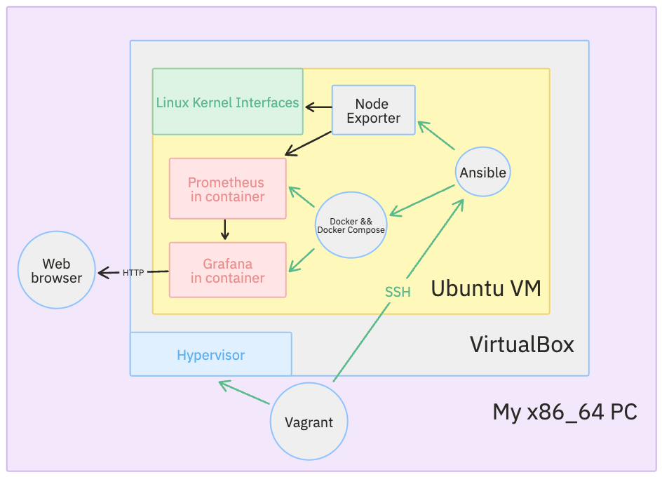

# infra-metrics-lab

Стенд для тестирования мониторинга: создание виртуальной машины, настройка с помощью Ansible и развёртывание
 стека мониторинга с помощью Docker Compose.

## Этапы создания проекта

### Этап 1: Подготовка среды разработки

- Установка Vagrant и VirtualBox
- Создание Vagrantfile для развертывания Ubuntu VM
  - `vagrant init` для создания скелета файла
  - Читаем комментарии, конфигурируем необходимую для стенда ВМ. При необходимости смотрим документацию.
  - В конце файла запускаем провижинг с помощью Ansible, запущенном внутри ВМ.

### Этап 2: Настройка VM с помощью Ansible

- Создание playbook.yml как основного сценария Ansible
- Добавляем задачи по:
  - Обновлению всех пакетов в системе
  - Установке Docker и Docker Compose
  - Разворачиванию контейнеров Prometheus и Grafana через Docker Compose

### Этап 3: Развёртывание стека мониторинга

- Запуск Prometheus и Grafana через Docker Compose
- Настройка Prometheus для сбора метрик от Node Exporter

### Этап 4: Визуализация метрик

- Установка Node Exporter на виртуальную машину
- Добавление панели "Node Exporter Full" в Grafana

### Этап 5: Доступ и мониторинг

- Открытие Grafana по адресу `http://localhost:3000`
- Просмотр метрик: CPU, память, диск и другие

---

## Схема стенда

## С какими сложностями столкнулся

- После запуска `vagrant up` машина успешно создавалась, однако playbook не запускался с ошибкой:
 *'Specified hosts and/or --limit does not match any hosts'*
  - **Решение:** Не найдя нигде параметра *--limit*, который бы явно указывался, я решил запустить провижонинг с опцией
    `ansible.verbose = true`, которая выводит отладочные сообщения при работе скрипта. Так я понял, что по умолчанию
    playbook запускается c *--limit={vm.define.value}*, что в моём случае **metrics-lab**. Значит можно или переопределить
    опцию --limit при запуске, или изменить название хоста в playbook на необходимое. Я выбрал второй вариант.
